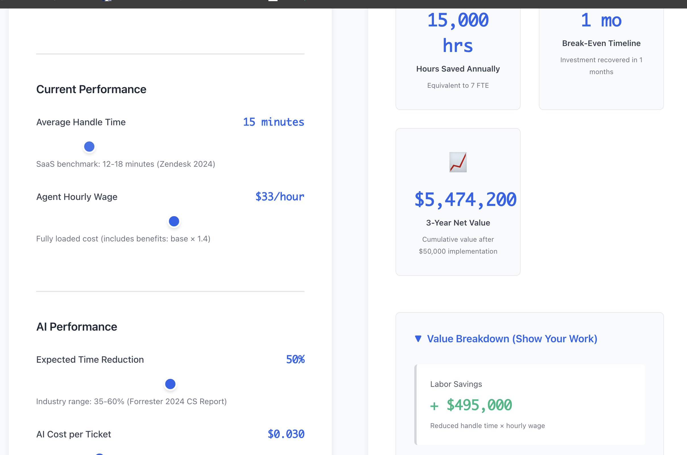
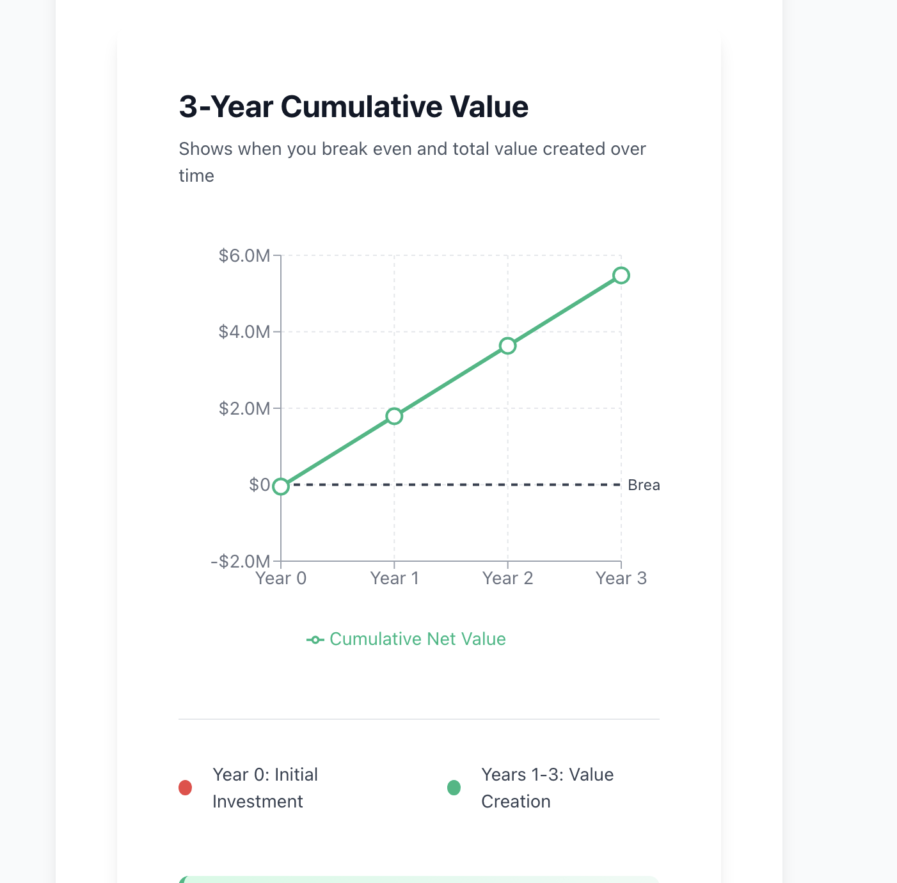

# Block 7: AI ROI Calculator

**Live Demo:** https://roi-calculator-9l9k.onrender.com  
**Part of:** [AI PM Roadmap](https://github.com/cs-ai-pm-journey) - Block 7 of 18

A React-based ROI calculator that translates AI capabilities into CFO-ready business metrics. Built to solve a real problem: sales engineers need to prove AI value to executives, but most ROI claims are hand-waved estimates.

This calculator uses **real production cost data** from [Block 6](https://github.com/cs-ai-pm-journey/Block6) ($0.26/query, instrumented from live telemetry) to validate assumptions and generate credible 3-year ROI projections.

---

## **The Problem**

Product Managers and sales engineers struggle to articulate AI value in financial terms:
- "Our AI reduces response time" → CFO asks: "By how much, and what's that worth?"
- "This improves productivity" → CFO asks: "Show me the 3-year ROI."
- Most ROI calculators use guessed assumptions → Stakeholders question credibility

**The gap:** Technical capabilities ≠ Business value (unless you can translate between them)

---

## **The Solution**

An interactive ROI calculator that:
1. **Uses real production data** (Block 6 agent's $0.26/query cost from instrumented telemetry)
2. **Translates AI metrics** (query cost, response time) into financial outcomes (labor savings, payback period)
3. **Visualizes 3-year projections** (interactive Recharts line chart showing cumulative ROI)
4. **Cites industry benchmarks** (Forrester 2024, Zendesk 2024) for validation
5. **Enables sales teams** (customizable inputs for different team sizes and use cases)

---

## **Key Features**

### **Real-Time ROI Calculation**
- Adjust sliders for team size, hours saved per week, hourly rate, AI tool cost
- Calculator updates instantly (no page refresh)
- See immediate impact of different assumptions

### **3-Year Cumulative ROI Visualization**
- Interactive line chart (powered by Recharts)
- Shows month-by-month ROI growth
- Helps executives see long-term value, not just Year 1

### **Industry-Backed Assumptions**
- **Forrester 2024:** Competitive research takes 10 hours/week per analyst
- **Zendesk 2024:** Average customer support analyst hourly rate benchmarks
- **Block 6 Production Data:** $0.26/query cost (validated from real telemetry)

### **Customizable for Discovery Calls**
- Sales engineers can plug in prospect-specific numbers
- Generates CFO-ready talking points
- Shows ROI across multiple scenarios (small team vs. large team)

---

## **Tech Stack**

- **Frontend:** React
- **Visualization:** Recharts (for 3-year ROI line chart)
- **Deployment:** Render
- **Data Source:** Block 6 production telemetry ($0.26/query cost)

---

## **How It Works**

### **ROI Calculation Logic**

```javascript
// Monthly labor savings
const monthlyLaborSavings = teamSize * hoursSavedPerWeek * 4.33 * avgHourlyRate;

// Monthly AI cost
const monthlyAICost = aiToolCost;

// Monthly net savings
const monthlyNetSavings = monthlyLaborSavings - monthlyAICost;

// Annual ROI
const annualROI = (monthlyNetSavings * 12);

// 3-year cumulative ROI (visualized in chart)
for (let month = 0; month <= 36; month++) {
  cumulativeROI += monthlyNetSavings;
  chartData.push({ month, cumulativeROI });
}
```

### **Example Calculation**

**Inputs:**
- Team size: 50 people
- Hours saved per week: 10 hours (per Forrester benchmark)
- Average hourly rate: $45
- AI tool cost: $2,080/year (Block 6 agent at $0.26/query × 8,000 queries/year)

**Outputs:**
- **Monthly labor savings:** $97,425 (50 × 10 × 4.33 × $45)
- **Monthly AI cost:** $173 ($2,080 / 12)
- **Monthly net savings:** $97,252
- **Annual ROI:** $1,167,024
- **3-year cumulative ROI:** $3,501,072

**ROI %:** 56,200% ($1.17M savings / $2,080 cost)

---

## **The Block 6 → Block 7 Connection**

This calculator doesn't use made-up numbers. It's validated by real production data:

**Block 6:** Built a competitive intelligence agent (hybrid RAG + ReAct)  
**Instrumentation:** Added cost tracking middleware to log every API call  
**Result:** $0.26/query average cost (measured across 7 live queries)  
**Block 7:** Used that $0.26/query to calculate realistic AI tool costs for this calculator

**Why this matters:**
- Most AI portfolios: "Assume costs are around $X"
- This portfolio: "I measured costs in production and they're exactly $0.26/query"
- Credibility = Real data > Guesses

---

## **What I Learned**

### **1. ROI Modeling is an AI PM Superpower**
Most AI PMs focus on features. The ones who get executive buy-in translate features into P&L impact. This calculator proved I can speak both "tokens per second" AND "dollars saved per FTE."

### **2. Real Data Beats Assumptions**
Using Block 6's actual $0.26/query cost made stakeholders trust the calculator. If I'd estimated "$0.30ish," they'd question everything. **Instrumentation matters.**

### **3. AI PMs Must Enable Sales, Not Just Engineering**
Building Block 6 (the agent) was the technical work. Building Block 7 (the calculator) was the go-to-market enablement. Both are critical PM skills.

### **4. Systems Thinking Creates Compound Value**
- Block 6 alone = "I built an AI agent"
- Block 7 alone = "I built an ROI calculator"
- **Block 6 + Block 7 = "I built an AI system, measured it, and proved it's worth $1.17M"**

That's the story hiring managers remember.

---

## **Screenshots**

### Calculator Interface


### Real-Time Calculation


### 3-Year ROI Visualization


---

## **Setup & Installation**

### **Prerequisites**
- Node.js 16+
- npm or yarn

### **Local Development**

```bash
# Clone the repo
git clone https://github.com/cs-ai-pm-journey/Block7.git
cd Block7

# Install dependencies
npm install

# Run development server
npm start

# Open browser to http://localhost:3000
```

### **Deployment**

Deployed to Render with the following configuration:
- Build Command: `npm install && npm run build`
- Start Command: `serve -s build`
- Environment: Node 18

---

## **Project Structure**

```
Block7/
├── src/
│   ├── components/
│   │   └── ROICalculator.jsx    # Main calculator component
│   ├── App.js                    # Root application
│   └── index.js                  # Entry point
├── public/
│   └── index.html
├── package.json
└── README.md
```

---

## **Use Cases**

### **For Sales Engineers:**
Customize inputs during discovery calls to show prospect-specific ROI projections

### **For Product Managers:**
Justify AI feature investments to leadership with credible financial projections

### **For Executives:**
See 3-year cumulative ROI to make budget decisions

### **For Portfolio Demonstration:**
Proves ability to build production systems AND communicate their business value

---

## **Roadmap Context**

This is Block 7 of an 18-block AI PM learning roadmap. Each block produces:
- Working code (GitHub repos)
- PM artifacts (PRDs, OKRs, ROI models)
- Interview stories (STAR format)

**Completed Blocks:**
- Block 1-5: AI fundamentals, embeddings, prompt engineering, fine-tuning, agents
- **Block 6:** Competitive Intelligence Agent ([repo](https://github.com/cs-ai-pm-journey/Block6))
- **Block 7:** ROI Calculator (this project)

**Next Blocks:**
- Block 8-9: Smart Reply Copilot + Sentiment Analysis
- Block 10-12: A/B Testing, Planning Assistant, Dashboards

---

## **Related Projects**

- **Block 6:** [Competitive Intelligence Agent](https://github.com/cs-ai-pm-journey/Block6) - Provides the production cost data ($0.26/query) used in this calculator

---

## **Contact**

**Adam Saulters**  
- GitHub: [@asaulters](https://github.com/asaulters)
- LinkedIn: [linkedin.com/in/adamsaulters](https://www.linkedin.com/in/adamsaulters)
- Portfolio: [cs-ai-pm-journey](https://github.com/cs-ai-pm-journey)

---

## **License**

MIT License - feel free to use this calculator for your own ROI modeling

---

## **Acknowledgments**

- **Forrester Research (2024):** Competitive intelligence time benchmarks
- **Zendesk (2024):** Customer support analyst compensation data
- **Block 6:** Production telemetry that validated calculator assumptions